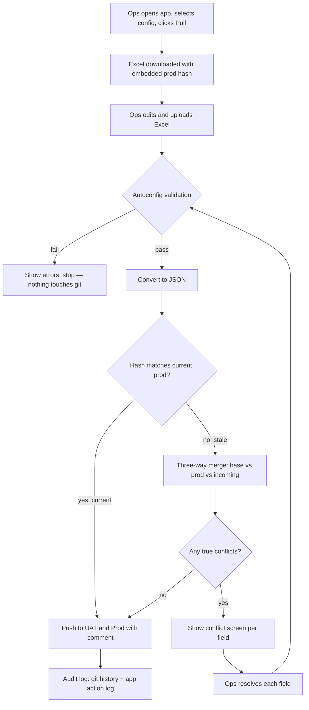
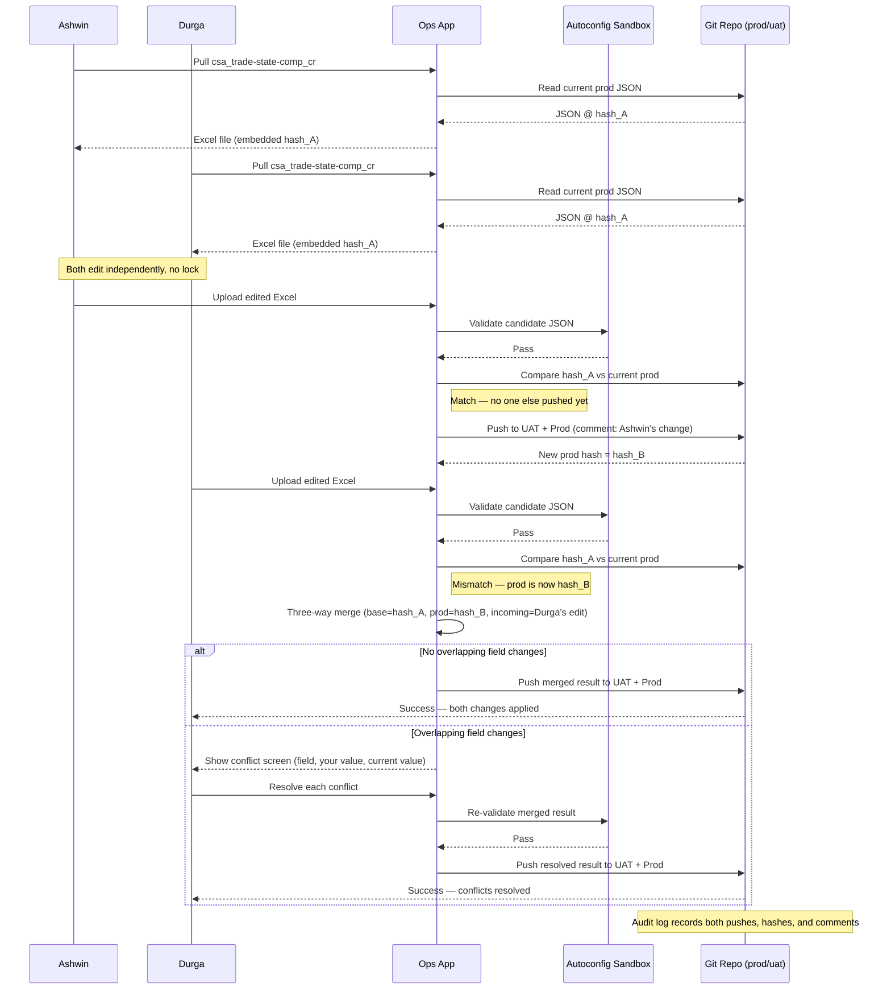

# Ops Config Management System — Design Document

## 1. Purpose

Ops team members maintain run-control configuration (500-600 config workbooks) currently stored as Excel files. This system lets ops edit configs through a simple app — no git knowledge required — while all changes are version-controlled in GitHub for full audit history, and multiple people can safely edit the same config in parallel.

## 2. Goals

- Ops never touches git directly — everything happens through pull/upload/autoconfig buttons.
- Every config change is tracked: who changed what, when, and why (git history + app audit log).
- Two or more people can work on the same config at the same time without blocking each other.
- A bad config never reaches production — it's validated before it's ever committed.
- Conflicting edits are resolved with a clear, plain-language screen — never silently overwritten.

## 3. Non-goals

- This is not a general-purpose git GUI. Ops only ever sees config-specific actions (pull, upload, validate, resolve conflict).
- Locking configs to a single editor is explicitly **not** used — see Section 6 for why.

## 4. System components

| Component | Responsibility |
|---|---|
| **Ops app (frontend)** | Config picker, pull/upload buttons, validation results, conflict resolution screen, status dashboard |
| **Backend API** | Orchestrates pull, upload, validate, merge, and push operations |
| **Autoconfig sandbox** | Runs existing autoconfig logic against a candidate JSON in isolation — no git side effects |
| **Merge engine** | Performs field-level three-way comparison between base, prod, and incoming versions |
| **Git repo** | Source of truth — `prod` and `uat` branches, one folder per config, JSON files per sheet |
| **CI (GitHub Actions)** | Schema/type validation as a second safety net on every push |
| **Audit layer** | App-level log of user actions (pull/upload/resolve/push), alongside git's own commit history |

## 5. End-to-end flow

### Step 1 — Pull
Ops opens the app, selects a config (e.g. `csa_trade-state-comp_cr`), and clicks **Pull**.
The backend reads the current `prod` version of that config's JSON, converts it to Excel, and embeds the current git commit hash as hidden metadata in the file. The Excel file downloads to the ops person's machine. This hash is the "base version" — the snapshot they're about to edit from.

There is **no lock** placed on the config. Anyone else can pull the same config at the same time.

### Step 2 — Edit
Ops edits the Excel file using normal Excel workflows. No git awareness needed at this stage.

### Step 3 — Upload
Ops uploads the edited Excel file back into the app.

### Step 4 — Autoconfig validation
The backend converts the Excel to JSON (in memory, not committed) and runs it through the **autoconfig sandbox** — the same validation logic used in production, but pointed at this candidate file only.

- **Fails** → stop here. Show the ops person the specific error (field, rule, message). Nothing touches git — no branch, no commit, no trace.
- **Passes** → continue to Step 5.

### Step 5 — Version compare
The backend reads the hash embedded in the uploaded file and compares it against the **current** `prod` commit hash for that config.

- **Match (ops's base = current prod)** → no one else has changed this config since they pulled it. Go straight to Step 7 (push).
- **Mismatch (someone else pushed in the meantime)** → go to Step 6 (three-way merge).

### Step 6 — Three-way merge (only when versions diverge)
This is the concurrent-editing safety net. The merge engine compares three versions field-by-field:

- **Base** — the config as it was when this ops person pulled it (their embedded hash)
- **Current prod** — the config as it is now, after someone else's push
- **Incoming** — what this ops person is uploading

For each field:
- Changed only in incoming → take incoming's value (no conflict)
- Changed only in current prod → keep prod's value (no conflict, someone else's already-accepted change)
- Changed in both, to the same value → no conflict
- **Changed in both, to different values → true conflict**

If there are true conflicts, show the ops person a plain-language screen (see Section 7) listing each conflicting field, both values, and who made the other change. They resolve each one, then the merged result goes back through autoconfig validation (Step 4) before proceeding.

### Step 7 — Push
Once the version is either current or successfully merged and re-validated, the backend commits and pushes the JSON to both `uat` and `prod` branches, with the ops person's change comment as the commit message.

### Step 8 — Audit
Every action — pull, upload, validation result, conflict resolution, push — is logged in the app's audit trail alongside git's own commit history. This gives a complete "who did what, when, and why" record.

## 6. Why no locking

An earlier version of this design considered locking a config while someone had it checked out. This was rejected because:

- A lock left open (e.g. someone pulls a config and doesn't upload for days) blocks everyone else indefinitely.
- Locking only prevents people from *starting* concurrent work — it doesn't remove the need for merge logic, since two people could still finish and upload around the same lock window.

The three-way merge (Section 5, Step 6) provides the real safety net, so locking adds friction without removing risk.

## 7. Conflict resolution screen (UI design)

When a true conflict is detected, ops sees a screen structured like this, per conflicting field:

```
Config: csa_trade-state-comp_cr — Sheet: rates
Field:  comp_cr (Trade ID: T001)

  Your value:        0.025
  Current value:     0.031   (updated by Durga, 2 hours ago)

  [ Keep mine ]   [ Keep theirs ]   [ Enter new value: ____ ]
```

Design principles:
- No git terms anywhere — no "merge," "conflict marker," or "branch."
- Show who made the other change and roughly when, so the ops person has context to decide.
- One field per conflict card — never a raw file diff.
- A "resolve all remaining with theirs / mine" bulk option if there are many conflicts, but individual override always available.
- After resolving all conflicts, the merged file is re-validated (Step 4) before it can be pushed — resolution doesn't skip the safety check.

## 8. Three-way merge — pseudocode

```
function three_way_merge(base_json, prod_json, incoming_json):
    result = {}
    conflicts = []

    all_keys = union(keys(base_json), keys(prod_json), keys(incoming_json))

    for key in all_keys:
        base_val    = base_json.get(key)
        prod_val    = prod_json.get(key)
        incoming_val = incoming_json.get(key)

        prod_changed     = (prod_val != base_val)
        incoming_changed = (incoming_val != base_val)

        if not prod_changed and not incoming_changed:
            result[key] = base_val

        else if prod_changed and not incoming_changed:
            result[key] = prod_val                    # take their change

        else if incoming_changed and not prod_changed:
            result[key] = incoming_val                # take ops's change

        else if prod_changed and incoming_changed:
            if prod_val == incoming_val:
                result[key] = prod_val                # both made the same change
            else:
                conflicts.append({
                    "field": key,
                    "your_value": incoming_val,
                    "current_value": prod_val,
                    "changed_by": get_last_editor(key)
                })
                result[key] = null                     # pending resolution

    return result, conflicts
```

Notes:
- This runs per-record (e.g. per trade ID row), not just per top-level key, so a change to `T001.comp_cr` and a separate change to `T002.state` never conflict with each other.
- `get_last_editor(key)` comes from the git commit that introduced the prod-side change — attributable from commit metadata or the app's own audit log.
- Once all conflicts are resolved by the ops person, their choices are merged into `result` and the file goes back through autoconfig validation before push.

## 9. Full flow diagram



## 10. Flow design — concurrent editing scenario

This sequence diagram shows the full flow end to end for the case that matters most: two ops people editing the same config around the same time.



**Reading this diagram:** Ashwin and Durga both start from the same base version (`hash_A`) since neither had to wait for a lock. Ashwin uploads first and moves prod forward to `hash_B` with no issue. When Durga uploads afterward, the app detects her base is now stale and runs the merge automatically — if her edits don't collide with Ashwin's, she never even sees a conflict screen; if they do collide on the same field, she resolves just that field and proceeds. Either way, both people's work ends up in prod without needing git commands or blocking each other.

## 11. Open items for implementation

- Confirm whether autoconfig can run synchronously with structured (field, rule, message) error output, or needs a wrapper to produce that format.
- Decide bulk-conflict UX (resolve-all-mine / resolve-all-theirs) thresholds — e.g. only offer bulk option above N conflicting fields.
- Define retention/rotation policy for the app-level audit log versus relying solely on git history.
- Decide whether `get_last_editor` pulls from git blame or a dedicated "who pushed this version" field maintained by the app.
